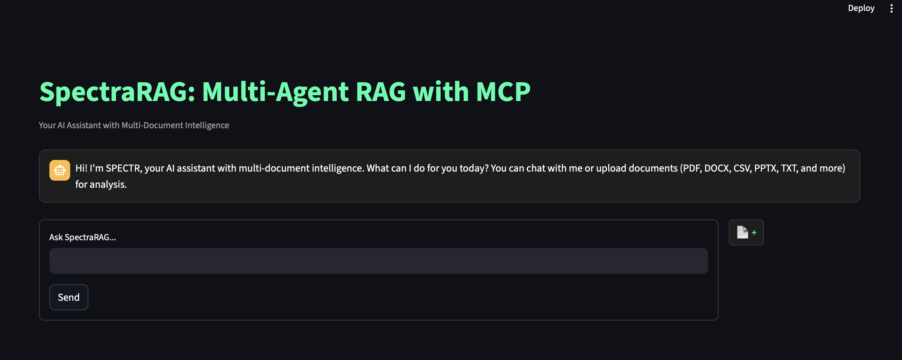
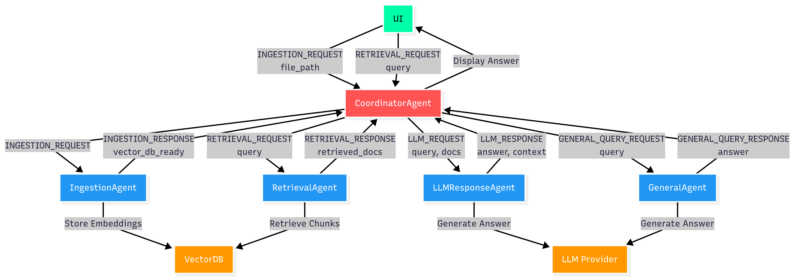

# SpectraRAG

**A Multi-Agent, Multi-Document Conversational Retrieval-Augmented Generation (RAG) System with Modular Agent Coordination**



---

## Table of Contents

- [Overview](#overview)
- [Key Features](#key-features)
- [System Architecture](#system-architecture)
- [Directory Structure](#directory-structure)
- [Implementation Details](#implementation-details)
  - [Agent Design](#agent-design)
  - [Model Context Protocol (MCP)](#model-context-protocol-mcp)
  - [Session and State Management](#session-and-state-management)
  - [End-to-End Workflow](#end-to-end-workflow)
- [Prerequisites](#prerequisites)
- [Setup and Usage](#setup-and-usage)
- [Development & Customization](#development--customization)
- [Challenges Faced](#challenges-faced)
- [Future Scope](#future-scope)
- [Troubleshooting](#troubleshooting)
- [Acknowledgements](#acknowledgements)

---

## Overview

SpectraRAG is a sophisticated, multi-agent Retrieval-Augmented Generation (RAG) system designed for conversational question-answering over multiple document formats. It leverages a modular agentic architecture with the Model Context Protocol (MCP) for seamless inter-agent communication. Users can upload documents (PDF, DOCX, PPTX, CSV, TXT/Markdown), which are processed, embedded, and stored in a session-specific vector database. The system supports multi-turn conversations, retrieving relevant document chunks to generate accurate responses or falling back to general knowledge when no documents are provided.

---

## Key Features

- **Multi-Agent Architecture**: Dedicated agents for ingestion, retrieval, response generation, and general queries.
- **Model Context Protocol (MCP)**: Asynchronous message-passing for robust agent coordination.
- **Multi-Format Document Support**: Handles PDF, DOCX, PPTX, CSV, and TXT/Markdown files.
- **Session-Aware VectorDB**: Per-session vector database with automatic cleanup on session end.
- **Multi-Turn Chat Interface**: Maintains conversation history for context-aware responses.
- **Streamlit UI**: Intuitive web interface for document uploads, querying, and response visualization.
- **Flexible LLM/Embedding Support**: Configurable providers (Gemini, OpenAI, Anthropic) via environment settings.
- **Error Handling & Logging**: Comprehensive logging for debugging and error tracking.

---

## System Architecture

SpectraRAG uses a modular, agent-based design orchestrated by the `MCPCoordinator`. The system flow is illustrated below:



### Components
- **Streamlit UI**: Handles user interactions, document uploads, and chat display.
- **MCPSpectraRagController**: Manages the RAG pipeline and session state.
- **MCPCoordinator**: Orchestrates agent communication via MCP.
- **Agents**:
  - **IngestionAgent**: Parses and embeds documents into a vector database.
  - **RetrievalAgent**: Retrieves relevant document chunks using semantic search.
  - **LLMResponseAgent**: Generates answers using retrieved context and user queries.
  - **GeneralAgent**: Handles queries without uploaded documents using general LLM knowledge.
- **VectorDB & Storage**: Session-specific storage for embeddings and uploaded files.

---

## Directory Structure

```
SpectraRAG/
│
├── app.py                # Streamlit UI and session logic
├── requirements.txt      # Project dependencies
├── .gitignore           # Git ignore rules
├── README.md            # Project documentation
├── assets/              # Static assets (e.g., images)
├── DATA/                # VectorDB storage (gitignored)
├── temp_uploads/        # Uploaded files (gitignored)
├── logs/                # Log files (gitignored)
│
├── src/
│   ├── Agents/
│   │   ├── embedder_agent.py      # Document ingestion and embedding
│   │   ├── retriever_agent.py     # Semantic retrieval
│   │   ├── response_agent.py      # LLM response generation
│   │   ├── general_agent.py       # General query handling
│   │   └── __init__.py
│   ├── components/
│   │   ├── states.py              # Pydantic schemas for agent state
│   │   ├── prompts.py             # System prompts for LLM
│   ├── mcp/
│   │   ├── coordinator.py         # Orchestrates agent communication
│   │   ├── mcp_agents.py          # MCP-enabled agent wrappers
│   │   ├── message_protocol.py    # MCP message bus and protocol
│   ├── pipeline/
│   │   ├── mcp_agent_spectr.py    # MCP-enabled RAG controller
│   │   ├── agent_spectr.py        # Legacy controller (non-MCP)
│   ├── utils.py                   # Utility functions (embeddings, LLM init)
│   └── logger.py                  # Logging configuration
│
└── config/
    ├── settings.py                # Configuration and API key management
    └── __init__.py
```

---

## Implementation Details

### Agent Design
- **IngestionAgent**: Parses documents using format-specific loaders (e.g., `PDFPlumberLoader`, `Docx2txtLoader`), splits them into chunks, and persists embeddings in a Chroma vector database.
- **RetrievalAgent**: Generates diverse search queries and retrieves relevant document chunks using embeddings.
- **LLMResponseAgent**: Formats retrieved chunks into a prompt and invokes the LLM to generate answers.
- **GeneralAgent**: Handles queries when no document is uploaded, using general LLM knowledge.

### Model Context Protocol (MCP)
- **Message Structure**: Structured messages with `sender`, `receiver`, `type`, `trace_id`, and `payload` fields.
- **Message Bus**: In-memory `MCPMessageBus` for asynchronous agent communication, with session-specific queues.
- **Coordination**: The `MCPCoordinator` routes messages between agents, ensuring pipeline execution.

### Session and State Management
- **Session IDs**: Unique UUIDs for each session to isolate vectorDBs and file storage.
- **Streamlit Session State**: Tracks document status, vectorDB readiness, and chat history.
- **Cleanup**: Automatic deletion of session-specific files and vectorDBs on session end or manual cleanup.

### End-to-End Workflow
1. **Document Upload**:
   - File saved to `temp_uploads/<session_id>`.
   - IngestionAgent triggered via MCP with `__EMBED_ONLY__` query.
   - VectorDB created and marked ready in session state.
2. **Query Processing**:
   - If vectorDB is ready: RetrievalAgent fetches relevant chunks, LLMResponseAgent generates answers.
   - If no documents: GeneralAgent responds using LLM knowledge.
3. **Response Display**: Answers with source context and trace ID displayed in the UI.
4. **Cleanup**: Triggered via UI button or session end, removing files and vectorDB.

---

## Prerequisites

- **Python**: Version 3.8 or higher.
- **API Keys**: Obtain keys for one or more supported LLM/embedding providers:
  - Google (Gemini): [Google Cloud Console](https://console.cloud.google.com/)
  - OpenAI: [OpenAI Platform](https://platform.openai.com/)
  - Anthropic: [Anthropic API](https://www.anthropic.com/)
- **Dependencies**: Listed in `requirements.txt` (e.g., `streamlit`, `langchain`, `langgraph`, `chromadb`).

---

## Setup and Usage

1. **Clone the Repository**:
   ```bash
   git clone https://github.com/kumar8074/SpectraRAG.git
   cd SpectraRAG
   ```

2. **Create a Virtual Environment**:
   ```bash
   python -m venv venv
   source venv/bin/activate  # On Windows: venv\Scripts\activate
   ```

3. **Install Dependencies**:
   ```bash
   pip install -r requirements.txt
   ```

4. **Configure API Keys**:
   - Create a `.env` file in the project root:
     ```bash
     cp .env.example .env
     ```
   - Add your API keys:
     ```plaintext
     GOOGLE_API_KEY=your_google_api_key_here
     OPENAI_API_KEY=your_openai_api_key_here
     ANTHROPIC_API_KEY=your_anthropic_api_key_here
     ```

5. **Run the Application**:
   ```bash
   streamlit run app.py
   ```

6. **Interact with SpectraRAG**:
   - Open the Streamlit UI in your browser (default: `http://localhost:8501`).
   - Upload a document (PDF, DOCX, PPTX, CSV, or TXT/Markdown).
   - Wait for the "VectorDB ready" message.
   - Ask questions about the document or general queries.
   - Use the "Clear Session" button to reset the session.

---

## Development & Customization

- **Add New Agents**: Create new agent logic in `src/Agents/` and register with `MCPCoordinator`.
- **Change VectorDB/Embedding**: Update `src/Agents/embedder_agent.py` and `src/utils.py` to support new vector stores or embedding models.
- **UI Enhancements**: Modify `app.py` and `src/utils.py` for custom styling or features.
- **Logging**: View logs in the `logs/` directory for debugging.
- **MCP Extensions**: Add new message types or payloads in `src/mcp/message_protocol.py`.


## Troubleshooting

- **API Key Errors**: Ensure `.env` file is correctly configured with valid API keys.
- **File Upload Failures**: Verify file types are supported and files are not corrupted.
- **VectorDB Issues**: Check `DATA/` directory permissions and ensure sufficient disk space.
- **Streamlit Crashes**: Increase memory allocation or check logs in `logs/` for errors.
- **Slow Responses**: Optimize chunk size in `embedder_agent.py` or use a more powerful LLM.

---

## Acknowledgements

- **Author**: [Lalan Kumar](https://github.com/kumar8074)
- **Technologies**: [LangChain](https://github.com/langchain-ai/langchain), [LangGraph](https://github.com/langchain-ai/langgraph), [Streamlit](https://github.com/streamlit/streamlit), [ChromaDB](https://github.com/chroma-core/chroma)
- **Contributions**: Open issues or PRs on [GitHub](https://github.com/kumar8074/SpectraRAG) for feedback or improvements.